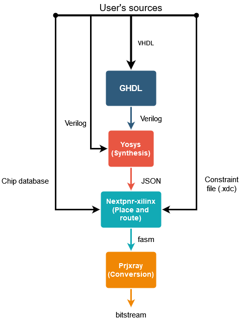

# Embedded FPGA bitstream generation for the Zynq-7000 serie


This repository presents all the necessary tools needed to implement an embedded FPGA bistream generator on the following boards from Xilinx :
<li> Zybo </li>
<li> Zedboard </li>
<br>
<div>

The system in question requires a CPU (Central Processing Unit), an FPGA (Field Programmable Gate Arrays) as well as an embedded Linux distribution. The computer system (CPU, RAM, etc.) must be powerful enough to run an embedded Linux distribution and synthesis tools. But this same distribution must also be adapted to the limits imposed by the low resources offered by FPGA cards. 

</div>


However, I highly recommend you to use this git as a guide to be able to run the same experiments : https://www.gricad-gitlab.univ-grenoble-alpes.fr/prostboa/zynq-foss


# Tool-chain

This repository contains all the necessary data to be able to generate a bitstream using the following tool-chain on both the Zedboard and the Zybo board : 


<p align="center">
  
</p>

<p align="center">
<b> Fig 1 : </b> Open-source tool-chain used to generate bitstreams on-board
</p>


<div>This figure displays how the tool-chain works. There is a total of four tools :</div>

<div>

<li> ghdl, to convert VHDL into Verilog to expend the user base,</li>

<li>yosys, for logic synthesis, </li>

<li>nextpnr-xilinx, for placement and routing (It still remains experimental as of today and lacks stability), </li>

<li>prjxray, for final conversion into bitstream files. </li>

</div>

# Repository structure

```plaintext
project-root/
├── CHIPDB/
│	├── xc7z010.bin
│	└── xc7z020.bin
├── docs/
├── scripts/
│	├── aes_script_com_axi.sh
│	├── aes_script.sh
│	└── com_axi.c
├── VHDL/
│   ├── exemples_bitstream/
│   ├── log/
│   ├── output/
│	├── source_zedboard/
│	├── source_zybo/
│	│		└──aes/
│	├── Makefile
│	└── vhdl2bitstream.sh
├── XDC
│	├── zedboard_bis.xdc
│	├── Zedboard-Master.xdc
│	└── ZYBO_Master.xdc
└── README.md
```


# Required dependancies (TODO)


Installer :
```bash
sudo apt-get install cmake libboost-all-dev 
	libeigen3-dev python3-dev build-essential clang bison flex 
	libreadline-dev gawk tcl-dev libffi-dev git python3-yaml 
	graphviz xdot pkg-config python3 libboost-system-dev 
	libboost-python-dev libboost-filesystem-dev zlib1g-dev 
	virtualenv python3-pip python3-virtualenv python3.11-venv 
	
```
Install ghdl:
```bash
sudo apt-get install ghdl 
```
Install Yosys :
```bash
sudo apt update
sudo apt -y install yosys
```


# Build

Clone these two repositories : 
```bash
git clone https://github.com/F4PGA/prjxray
git clone https://github.com/gatecat/nextpnr-xilinx
```

In prjxray  : 

```bash
cd prjxray
git submodule update --init --recursive 
make build
./download-latest-db.sh
make env # It creates the Python environment
```

In nextpnr-xilinx : 
```bash
git submodule update --init --recursive 
cd nextpnr-xilinx
cmake . -DARCH=xilinx
make -j$(nproc)
git submodule init
git submodule update
```

Generate the xc7z010.bin and the xc7z020.bin : 
```bash
cd nextpnr-xilinx

# For the Zybo architecture
python3 xilinx/python/bbaexport.py --device xc7z010clg400-1 --bba xilinx/xc7z010.bba
./bba/bbasm --l xilinx/xc7z010.bba ../CHIPDB/xc7z010.bin

# For the Zedboard architecture
python3 xilinx/python/bbaexport.py --device xc7z020clg400-1 --bba xilinx/xc7z020.bba
./bba/bbasm --l xilinx/xc7z020.bba ../CHIPDB/xc7z020.bin
```

# Case study

A security related case study is included in this repository. To know more, I invite you to read this paper (TODO Comming soon) mentionning this.

# License

The contents of this repository are licensed under the EUPL license.

A copy of the license is provided in this repository in file LICENSE-EUPL-1.2-EN.txt.

More information on the EUPL website.

Exception : the contents of directory hdl/zipcpu are selected AXI bridge implementations from ZipCPU repository.
The license for these files is then Apache 2.0.
Minor changes have been added in order to fix Yosys errors, however without real understanding of the overall implementation.