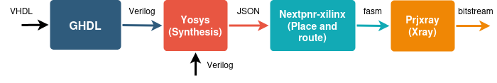

# Tool-chain

This repository contains all the necessary data to be able to generate a bitstream using the following tool-chain on both the Zedboard and the Zybo board : 



<div style="text-align: center;">Fig 1 : Open-source tool-chain used to generate bitstreams on-board</div>

<div>This figure displays how the tool-chain works. First, it translates all the VHDL code into Verilog. Then, the synthesis is done using Yosys which generate a netlist is the JSON format. Following this, the Nextpnr place-and-route the netlist and generate a .fasm file. Finally, Prjxray converts the .fasm file into a bitstream.</div>

# Répertoire

```plaintext
project-root/
├── CHIPDB/
│	├── xc7z010.bin
│	└── xc7z020.bin
├── docs/
├── scripts/
│	├── aes_script_com_axi.sh
│	├── aes_script.sh
│	└── com_axi.c
├── VHDL/
│   ├── exemples_bitstream/
│   ├── log/
│   ├── output/
│	├── source_zedboard/
│	├── source_zybo/
│	│		└──aes/
│	├── Makefile
│	└── vhdl2bitstream.sh
├── XDC
│	├── zedboard_bis.xdc
│	├── Zedboard-Master.xdc
│	└── ZYBO_Master.xdc
└── README.md
```


# Prérequis


Installer :
```bash
sudo apt-get install cmake libboost-all-dev 
	libeigen3-dev python3-dev build-essential clang bison flex 
	libreadline-dev gawk tcl-dev libffi-dev git python3-yaml 
	graphviz xdot pkg-config python3 libboost-system-dev 
	libboost-python-dev libboost-filesystem-dev zlib1g-dev 
	virtualenv python3-pip python3-virtualenv python3.11-venv 
	
```
Installer ghdl et gtkwave (pour voir les signaux) :
```bash
sudo apt-get install ghdl gtkwave 
```
Installer Yosys :
```bash
sudo apt update
sudo apt -y install yosys
```


# Build du répertoire

Cloner ces deux répertoires : 
```bash
git clone https://github.com/F4PGA/prjxray
git clone https://github.com/gatecat/nextpnr-xilinx
```

Dans prjxray  : 

```bash
cd prjxray
git submodule update --init --recursive 
make build
./download-latest-db.sh
make env #Pour utiliser l'environnement Python de prjxray
```

Dans nextpnr-xilinx : 
```bash
git submodule update --init --recursive 
cd nextpnr-xilinx
cmake . -DARCH=xilinx
make -j$(nproc)
git submodule init
git submodule update
```

Génération du fichier xc7z010.bin ou xc7z020.bin (Optionnel) : 
```bash
cd nextpnr-xilinx
python3 xilinx/python/bbaexport.py --device xc7z010clg400-1 --bba xilinx/xc7z010.bba
./bba/bbasm --l xilinx/xc7z010.bba ../CHIPDB/xc7z010.bin
```
# Pratique

## Convertir du VHDL en verilog

Pour convertir du VHDL en verilog, effectuer les commandes suivantes :
```bash
ghdl -a -fsynopsys ${fichier.vhd}
ghdl synth -fsynopsys --out=verilog ${fichier_architecture} > ${fichier_ghdl.v}
```

## Utilisation

Pour faire de la synthèse :
```bash
./${YOSYS_DIR}/yosys -p "synth_xilinx -arch xc7 -top ${TOP_ENTITY}; write_json $PROJECT_DIR/NETLIST.json" /SOURCE.v
```
Pour réaliser le placement-routage
```bash
./${NEXTPNR_DIR}/nextpnr-xilinx --chipdb $CHIPDB_DIR/$CHIPDB.bin --xdc $XDC_DIR/$XDC.xdc --json $NETLIST.json --write $NETLISTROUTED.json --fasm $FASM.fasm
```
Conversion fasm vers frames puis vers bitstream :
```bash
source ${XRAY_UTILS_DIR}/env/activate # On se met d'abord dans l'environnement Python de prjxray
# Exemple pour la Zybo : on utilise xc7z010clg400-1
${XRAY_UTILS_DIR}/fasm2frames.py --part xc7z010clg400-1 --db-root ${XRAY_UTILS_DIR}/../database/zynq7 FASM.fasm > FRAMES.frames

${XRAY_TOOLS_DIR}/xc7frames2bit --part_file ${XRAY_UTILS_DIR}/../database/zynq7/xc7z010clg400-1/part.yaml --part_name xc7z010clg400-1 --frm_file FRAMES.frames --output_file ${OUTPUT_DIR}/BITSTREAM.bit

deactivate
```
Pour charger le bitstream sur la board (exemple Zybo)
```bash
openFPGALoader -b zybo_z7_10 $BITSTREAM.bit
```

# Synthèse sur Zybo/Zedboard

## Installation

	Installation sur Petalinux : (Cf git de Damien Morlier : https://gricad-gitlab.univ-grenoble-alpes.fr/morlierd/dspnr-damienmorlier)

	Installation sur Arch Linux : Utiliser le package fournis (TODO)

## Utilisation

	Pour utiliser les outils et générer le bitstream à partir du code source, merci d'utiliser les scripts qui utilisent des commandes similaires.

	Pour charger le bitstream depuis la board : 
	```bash
	cat $BISTREAM.bit > /dev/xdevcfg
	```

